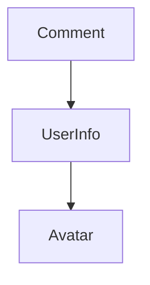

All credits go to their original authors.

This is a living document I put together as I learn. Some notes here were extracted from the learning materials in the reference section.

I tried to include links wherever possible, if I missed anything, I will be more than happy to make updates if you let me know.

## Reference

- The [step-by-step guide](https://reactjs.org/docs/hello-world.html) on reactjs.org

## What is React.js

> React is a declarative, efficient, and flexible JavaScript library for building user interfaces. It has a few building blocks such as elements, components etc.
>
> [Reactjs.org](https://reactjs.org/tutorial/tutorial.html#what-is-react)

## Elements

Elements are the smallest building blocks of React apps.

An element describes what you want to see on the screen:

```jsx
const element = <h1>Hello world</h1>;
```

Unlike browser DOM elements, React elements are plain objects, and are *computationally* cheap to create. React DOM takes care of updating the DOM to match the React elements.

## Components

Components let you split the UI into independent, reusable pieces, and think about each piece in isolation.

Components are like JavaScript functions. They accept arbitrary inputs (called “props”) and return React elements describing what should appear on the screen.

A simple one:

```jsx
function Avatar(props) {
  return (
    
  );
}
```

## Props

`props` (really properties) is a collection of parameters passed on to the component.

Props is actually stored within the component. Any method in this component (class) can reference the props using `this.props.`

We recommend naming props from the component’s own point of view rather than the context in which it is being used.

In this example, despite the `Avatar` will be used in a commenting component, we've given its prop a more generic name: `user` rather than `author`. The rationale being: It doesn’t need to know context such as where it is being rendered. That's a sort of isolation that helps in producing clear code.

## Calling a component in another component

The diagram illustrates how component calls another component. 



Comment --> UserInfo:

```jsx
function Comment(props) {
  return (
    <div className="Comment">
      <UserInfo user={props.author} />
      <div className="Comment-text">
        {props.text}
      </div>
      <div className="Comment-date">
        {formatDate(props.date)}
      </div>
    </div>
  );
}
```

UserInfo --> Avatar:

```jsx
function UserInfo(props) {
  return (
    <div className="UserInfo">
      <Avatar user={props.user} />
      <div className="UserInfo-name">
        {props.user.name}
      </div>
    </div>
  );
}
```

## Props are Immutable, i.e. Read-Only

Whether you declare a component as a function or a class, it must never modify its own props.

## Class, State and Lifecycle

`class` is introduced in ES6. It is common practice to write a class as opposed to function.

A class has a few built-in methods including:

- `constructor()`. See [here](https://reactjs.org/docs/react-component.html#constructor)

- `componentDidMount()`. It is called when the object is rendered to the DOM for the first time. See [here](https://reactjs.org/docs/react-component.html#componentdidmount)
- `componentWillUnmount()`. It is called when the DOM produced by the object is removed. See [here](https://reactjs.org/docs/react-component.html#componentwillunmount)

A diagram to help understand lifecycle:



For a visual reference, click [here](https://projects.wojtekmaj.pl/react-lifecycle-methods-diagram/)

A typical component class also need to implement its own `render()`.

`state` is a built-in object in class.

<details>
  <summary>Click to see code example and explainations</summary>

```jsx
class Clock extends React.Component {
  constructor(props) {
    // for a React.Component subclass, you should call 
    // super(props) before any other statement
    super(props);
    // in constructor, you should not call setState(),
    // instead, assign the initial state to this.state directly
    this.state = {date: new Date()};
  }

  componentDidMount() {
    this.timerID = setInterval(
      () => this.tick(),
      1000
    );
  }

  componentWillUnmount() {
    clearInterval(this.timerID);
  }

  tick() {
    this.setState({
      date: new Date()
    });
  }

  render() {
    return (
      <div>
        <h1>Hello, world!</h1>
        <h2>It is {this.state.date.toLocaleTimeString()}.</h2></h2></h2>
      </div>
    );
  }
}

ReactDOM.render(
  <Clock />,
  document.getElementById('root')
);
```

1. When `<Clock />` is passed to `ReactDOM.render()`, React calls the constructor of the Clock component. Since Clock needs to display the current time, it initializes `this.state` with an object including the current time. We will later update this state.

2. React then calls the Clock component’s `render()` method. This is how React learns what should be displayed on the screen. React then updates the DOM to match the Clock’s render output.
3. When the Clock output is inserted in the DOM, React calls the `componentDidMount()` lifecycle method. Inside it, the Clock component asks the browser to set up a timer to call the component’s `tick()` method once a second.
4. Every second the browser calls the `tick()` method. Inside it, the Clock component schedules a UI update by calling `setState()` with an object containing the current time.

    👉 Important: Thanks to the `setState()` call, React knows the state has changed, and calls the render() method again to learn what should be on the screen. This time, `this.state.date` in the `render()` method will be different, and so the render output will include the updated time. React updates the DOM accordingly.

5. If the Clock component is ever removed from the DOM, React calls the `componentWillUnmount()` lifecycle method so the timer is stopped.

</details>

## Props vs State

This is a growing list.

### "rendered" value

In React, both this.props and this.state represent the rendered values, i.e. what’s currently on the screen.

### Both props and state can be accessed by "this"

Both `this.state.` and `this.props.` are valid calls within the class scope.

### Props are immutable

It is not supposed to be modified in any way. If the component needs to be "stateful" during the calls, always use state.

### Avoid Copying Props into State

  ```jsx
  constructor(props) {
  super(props);
  // Don't do this!
  this.state = { color: props.color };
  }
  ```

  <details>
    <summary>This is a common mistake.</summary>

  It’s unnecessary (use `this.props.color` instead) and prone to bugs (updates to the `color` prop won’t be reflected in the state).

  Only use it if you want to disregard prop updates. ~~In that case, it makes sense to rename the prop to be called `initialColor` or `defaultColor`. You can then force a component to “reset” its internal state by changing its key when necessary.~~

  Read [this post](https://reactjs.org/blog/2018/06/07/you-probably-dont-need-derived-state.html) on avoiding derived state to learn about what to do if you think you need some state to depend on the props.

  [Reactjs.org](https://reactjs.org/docs/react-component.html#constructor)

  </details>

### State Updates May Be Asynchronous

`setState()` schedules an update to a component’s state object. When state changes, the component responds by re-rendering.

Consider using setState() that accepts a function rather than an object when you need to update state variables.

<details>
    <summary>React may batch multiple setState() calls into a single update for performance.</summary>

In React, `state` must only be updated by `setState()` (only exception is within `constructor()`).

This is because manual updates won't trigger UI updates since React doesn't know state has changed.

To fix it, use a second form of setState() that accepts a "updater" function object as parameter.

```jsx
// Wrong. counter may not be updated immediately since setState() may be delayed in execution by React
this.setState({
  counter: this.state.counter + this.props.increment,
});

// Correct. See explaination above
this.setState((state, props) => ({
  counter: state.counter + props.increment
}));
```

In React, "updater" function takes the following signature:

```jsx
(state, props) => stateChange
```

The return value of the `updater` is shallowly merged with state. For example, in the following code,  the return value of the function. will be assigned to `state.counter`:

```jsx
this.setState((state, props) => {
  return {counter: state.counter + props.step};
});
```

</details>

### State holds all its variables

React merges the object you provide into the current state.

```jsx
constructor(props) {
  super(props);
  this.state = {
    posts: [],
    comments: []
  };
}
```

When you update `comments` with the following code, it leaves `this.state.posts` intact, but completely replaces `this.state.comments`.

### State is not accessible to other components

State has a limited scope to its own component. 

It is not accessible to any component other than the one that owns and sets it.

It is the philosophy that neither parent nor child components can know if a certain component is stateful or stateless, and they shouldn’t care its implementation details, such as whether it is defined as a function or a class.

In React apps, whether a component is stateful or stateless is considered an implementation detail of the component that may change over time. You can use stateless components inside stateful components, and vice versa.

### Binding and "this." in any class method

`this` is `undefined` until the it is bound. 

<details>
<summary>In JavaScript, class methods are not bound by default.</summary>

If you forget to bind `this.handleClick` and pass it to `onClick`, this will be undefined when the function is actually called.

This is not React-specific; it is a part of [how functions work in JavaScript](https://www.smashingmagazine.com/2014/01/understanding-javascript-function-prototype-bind/).

Generally, if you refer to a method without () after it, such as onClick={this.handleClick}, you should bind that method.

There are two (recommended) ways to do it:

```jsx
// bind a method in constructor
constructor(props) {
  super(props);
  this.state = {isToggleOn: true};

  // This binding is necessary to make `this` work in the callback
  this.handleClick = this.handleClick.bind(this);
}

// or the following way
handleClick = () => {
  console.log('this is:', this);
}
```

In either way, the method is bound and the render() will work:

```jsx
render() {
  return (
    <button onClick={this.handleClick}>
      Click me
    </button>
  );
}
```
