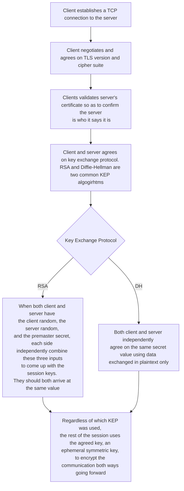

At a high level, the following occurs during a TLS handshake:

Read more about DH [here](https://en.wikipedia.org/wiki/Diffie%E2%80%93Hellman_key_exchange#Cryptographic_explanation)

## Key Takeaways About the KEPs

👉 DH achieves forward secrecy while RSA does not.

👉 DH handshake takes longer than RSA.

## What Else You Need To Know about TLS

- TLS 1.0 and TLS 1.1 are no longer secure and should be avoided. A best practice is to use TLS version is 1.2 or later at the time of writing.

- HTTPS means "HTTP over TLS".

- Both SSH and TLS are purpose-built for secure communication over the Internet, but they are very different in many ways. Check out [my another post]() where I explain the differences between the two. Thanks!
