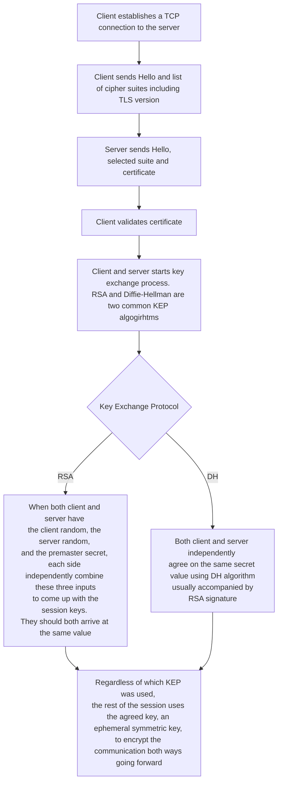

At a high level, the following occurs during a TLS handshake:

Read more about DH [here](https://en.wikipedia.org/wiki/Diffie%E2%80%93Hellman_key_exchange#Cryptographic_explanation)

## Key Takeaways About the KEPs

👉 DH achieves forward secrecy while RSA does not.

👉 DH handshake takes longer than RSA.

## What Else You Need To Know about TLS

- TLS 1.0 and TLS 1.1 are no longer secure and should be avoided. A best practice is to use TLS version is 1.2 or later at the time of writing.

- HTTPS means "HTTP over TLS".

- Both SSH and TLS are purpose-built for secure communication over the Internet, but they are very different in many ways. Check out [my another post]() where I explain the differences between the two.

## Glossary

### Cipher Suite

A cipher suite is a set of algorithms. It usually contain include: a key exchange algorithm, a bulk encryption algorithm, and a message authentication code (MAC) algorithm.

For example, `TLS_ECDHE_RSA_WITH_AES_128_GCM_SHA256` means:

- ECDHE_RSA indicates the key exchange algorithm being used.

- AES_128_GCM indicates the block cipher being used to encrypt the message stream, together with the block cipher mode of operation.
- SHA256 indicates the message authentication algorithm which is used to authenticate a message.

### ECDHE_RSA key exchange algorithm

In a nutshell, it is ECDHE signed by RSA. Signing defeats man-in-the-middle attack. See detail [here](https://en.wikipedia.org/wiki/Elliptic-curve_Diffie-Hellman)
