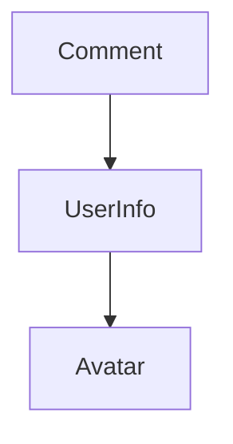

TLDR

As a recovering C++ developer learning React, I put together some notes along the journey.

Some of the notes and example code were extracted from the materials listed in the reference. I've tried to include links but feel free to let me know if I missed something.

Credit goes to the original authors.

## Reference

- [Step-by-step guide](https://reactjs.org/docs/hello-world.html). Great learning material.

## What is React.js

> React is a declarative, efficient, and flexible JavaScript library for building user interfaces. It has a few building blocks such as elements, components etc.
>
> [Reactjs.org](https://reactjs.org/tutorial/tutorial.html#what-is-react)

## Elements

An element describes what you want to see on the screen:

```jsx
const element = <h1>Hello world</h1>;
const div1 = <div />;
```

## Components

Elements such as `<div />` are defined in [HTML5](https://developer.mozilla.org/docs/Web/HTML/Element/div). React extends it by introducing user-defined elements such as

```jsx
<Welcome name="Sara" />
```

`Welcome` is a user-defined component. In React, always start component names with a capital letter to follow the naming convention.

### Why Components

Components let you split the UI into independent, reusable pieces, and think about each piece in isolation.

React component can be declared as a JS function or a JS class. Either way, it accepts input (called “props”) and return React elements describing what should appear on the screen.

When React sees an element representing a user-defined component, it wraps up JSX attributes and children and passes it as a single object (called `props`) to the component implicitly without user code.

`props`stands for properties.

### React function

An example:

```jsx
function Welcome(props) {
  return <h1>Hello, {props.name}</h1>;
}

const element = <Welcome name="Sara" />;
ReactDOM.render(
  element,
  document.getElementById('root')
);
```

JS code starts at the top of the file. It gets executed from top to bottom. There is no entry point such as what "main()" has to do in C++.

What happens in the example above is:

1. React calls ReactDOM.render() with the `<Welcome name="Sara" />`

2. React sees `Welcome` is a user-defined component and calls its corresponding function with `{name: 'Sara'}` as the props.
3. Welcome component returns `<h1>Hello, Sara</h1>` as the result.
4. React takes care of updating the DOM with `<h1>Hello, Sara</h1>`.

### React class

The function component example above can be equivalently rewritten as a class component:

```jsx
class Welcome extends React.Component {
  render() {
    return <h1>Hello, {this.props.name}</h1>;
  }
}
```

React class component always "inherited" from `React.Component`.

`render()` is the only method that any class "inherited" from `React.Component` must declare.

{}

Think of `render()` as a C++ pure virtual function in `React.Component`.

A derived class would have to implement it before the class can be instantiated.

{}

## Calling a component in another component

Let's take function component as an example.



Comment passed the value of its own `props.author` to UserInfo.

```jsx
function Comment(props) {
  return (
    <div className="Comment">
      <UserInfo user={props.author} />
      <div className="Comment-text">
        {props.text}
      </div>
      <div className="Comment-date">
        {formatDate(props.date)}
      </div>
    </div>
  );
}
```

UserInfo's props contains a key value pair "user=..." received from Comment. The value then gets passed down to Avatar.

```jsx
function UserInfo(props) {
  return (
    <div className="UserInfo">
      <Avatar user={props.user} />
      <div className="UserInfo-name">
        {props.user.name}
      </div>
    </div>
  );
}
```

## Props

Props gets passed to the constructor of class and stored as a class variable. Any method thereafer can reference it using `this.props`

{}
In a class component, think of `this.props` as a const reference member variable in C++.

It is initiated within `constructor(props)` where `super(props)` is called, the superclass always being `React.Component`.
{}

We recommend naming props from the component’s own point of view rather than the context in which it is being used. The rationale being: It doesn’t need to know context such as where it is being rendered.

That's a sort of isolation that helps in producing clear code.

### Props are Immutable

Whether you declare a component as a function or a class, it must never modify its own props.

The following code is valid in javascript syntax but should not be used as React component as it changes its own input:

```jsx
function withdraw(account, amount) {
  account.total -= amount;
}
```

{}
Think of JS function parameter as pass by reference in C++.

In React, treat `props` as if it is const reference in C++.
{}

## Class, State and Lifecycle

One difference between class and function is that class has a special object called `this.states`. states acts as a "container" that preserves variables between calls. In other words, class oject is "stateful" while function is "stateless".

A class has a few built-in methods including:

- `constructor()`. See [here](https://reactjs.org/docs/react-component.html#constructor)

- `componentDidMount()`. It is called when the object is rendered to the DOM for the first time. See [here](https://reactjs.org/docs/react-component.html#componentdidmount)
- `componentWillUnmount()`. It is called when the DOM produced by the object is removed. See [here](https://reactjs.org/docs/react-component.html#componentwillunmount)

A diagram to help understand lifecycle:



For a visual reference, click [here](https://projects.wojtekmaj.pl/react-lifecycle-methods-diagram/)

`state` is a built-in object in class.

<details>
  <summary>Click to see code example and explainations</summary>

```jsx
class Clock extends React.Component {
  constructor(props) {
    // for a React.Component subclass, you should call 
    // super(props) before any other statement
    super(props);
    // in constructor, you should not call setState(),
    // instead, assign the initial state to this.state directly
    this.state = {date: new Date()};
  }

  componentDidMount() {
    this.timerID = setInterval(
      () => this.tick(),
      1000
    );
  }

  componentWillUnmount() {
    clearInterval(this.timerID);
  }

  tick() {
    this.setState({
      date: new Date()
    });
  }

  render() {
    return (
      <div>
        <h1>Hello, world!</h1>
        <h2>It is {this.state.date.toLocaleTimeString()}.</h2></h2></h2>
      </div>
    );
  }
}

ReactDOM.render(
  <Clock />,
  document.getElementById('root')
);
```

1. When `<Clock />` is passed to `ReactDOM.render()`, React calls the constructor of the Clock component. Since Clock needs to display the current time, it initializes `this.state` with an object including the current time. We will later update this state.

2. React then calls the Clock component’s `render()` method. This is how React learns what should be displayed on the screen. React then updates the DOM to match the Clock’s render output.
3. When the Clock output is inserted in the DOM, React calls the `componentDidMount()` lifecycle method. Inside it, the Clock component asks the browser to set up a timer to call the component’s `tick()` method once a second.
4. Every second the browser calls the `tick()` method. Inside it, the Clock component schedules a UI update by calling `setState()` with an object containing the current time.

    👉 Important: Thanks to the `setState()` call, React knows the state has changed, and calls the render() method again to learn what should be on the screen. This time, `this.state.date` in the `render()` method will be different, and so the render output will include the updated time. React updates the DOM accordingly.

5. If the Clock component is ever removed from the DOM, React calls the `componentWillUnmount()` lifecycle method so the timer is stopped.

</details>

## Props vs State

This is a growing list.

### "rendered" value

In React, both this.props and this.state represent the rendered values, i.e. what’s currently on the screen.

### Both props and state can be accessed by "this"

Both `this.state` and `this.props` are valid within the class scope.

### Props are immutable

It is not supposed to be modified in any way. If the component needs to be "stateful" during the calls, always use state.

### Avoid Copying Props into State

  ```jsx
  constructor(props) {
  super(props);
  // Don't do this!
  this.state = { color: props.color };
  }
  ```

  <details>
    <summary>This is a common mistake.</summary>

  It’s unnecessary (use `this.props.color` instead) and prone to bugs (updates to the `color` prop won’t be reflected in the state).

  Only use it if you want to disregard prop updates. ~~In that case, it makes sense to rename the prop to be called `initialColor` or `defaultColor`. You can then force a component to “reset” its internal state by changing its key when necessary.~~

  Read [this post](https://reactjs.org/blog/2018/06/07/you-probably-dont-need-derived-state.html) on avoiding derived state to learn about what to do if you think you need some state to depend on the props.

  [Reactjs.org](https://reactjs.org/docs/react-component.html#constructor)

  </details>

### State Updates May Be Asynchronous

`setState()` "schedules" an update to a component’s state object. When state changes, the component responds by re-rendering.

Consider using setState() that accepts a function rather than an object when you need to update state variables.

<details>
    <summary>React may batch multiple setState() calls into a single update for performance.</summary>

In React, `state` must only be updated by `setState()` (only exception is within `constructor()`).

This is because manual updates won't trigger UI updates since React doesn't know state has changed.

To fix it, use a second form of setState() that accepts a "updater" function object as parameter.

```jsx
// Wrong. counter may not be updated immediately since setState() may be delayed in execution by React
this.setState({
  counter: this.state.counter + this.props.increment,
});

// Correct. See explaination above
this.setState((state, props) => ({
  counter: state.counter + props.increment
}));
```

In React, "updater" function takes the following signature:

```jsx
(state, props) => stateChange
```

The return value of the `updater` is shallowly merged with state. For example, in the following code,  the return value of the function. will be assigned to `state.counter`:

```jsx
this.setState((state, props) => {
  return {counter: state.counter + props.step};
});
```

</details>

### State holds all its variables

React merges the object you provide into the current state.

```jsx
constructor(props) {
  super(props);
  this.state = {
    posts: [],
    comments: []
  };
}
```

When you update `comments` with the following code, it leaves `this.state.posts` intact, but completely replaces `this.state.comments`.

### State is not accessible to other components

State is not accessible to any component other than the one that owns and sets it.

{}

Think of state as a "protected" member variable encapsulated in React.Component class. It can be accessed by its derived classed but not from outside.

{}

It is the philosophy that neither parent nor child components can know if a certain component is stateful or stateless, and they shouldn’t care its implementation details, such as whether it is defined as a function or a class.

In React apps, whether a component is stateful or stateless is considered an implementation detail of the component that may change over time. You can use stateless components inside stateful components, and vice versa.

### Be cautious about using "this" in a class method

Unlike in C++ where `this` is accessible in any class method including in the constructor, in JS, `this` is `undefined` until it is bound.

First, let's take a look at [this example](https://codepen.io/davxiao/pen/PoZpajQ) where I purposely made an attempt to access `this` in constructor and get the following error:

```
Uncaught ReferenceError: Must call super constructor in derived class before accessing 'this' or returning from derived constructor
 at pen.js:-12
```

Second, in member methods `this` is `undefined` until it is bound.

In the following example code, if you forget to bind `this.handleClick` and pass it to `onClick`, this will be undefined when the function is actually called.

This is not React-specific; it is a part of [how functions work in JavaScript](https://www.smashingmagazine.com/2014/01/understanding-javascript-function-prototype-bind/).

Generally, if you refer to a method without () after it, such as onClick={this.handleClick}, you should bind that method.

There are two (recommended) ways to do it:

```jsx
// bind a method in constructor
constructor(props) {
  super(props);
  this.state = {isToggleOn: true};

  // This binding is necessary to make `this` work in the callback
  this.handleClick = this.handleClick.bind(this);
}

// or the following way
handleClick = () => {
  console.log('this is:', this);
}
```

In either way, the method is bound and the render() will work:

```jsx
render() {
  return (
    <button onClick={this.handleClick}>
      Click me
    </button>
  );
}
```
